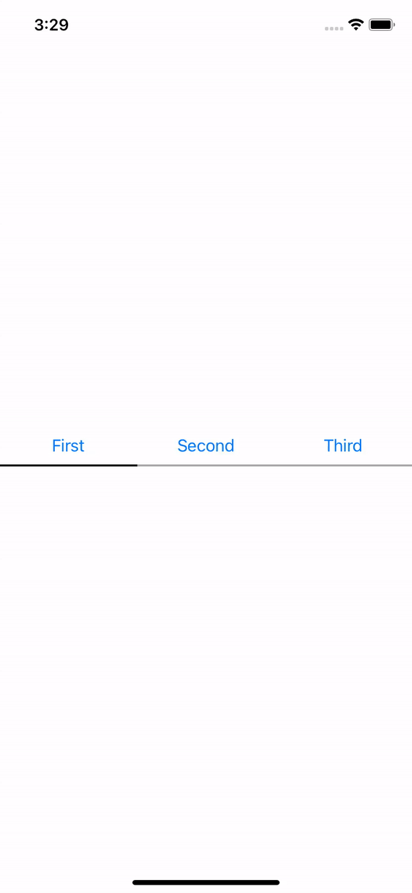

# Custom Segment Control
Create segment control like instagram pofile followers and following.



[Demo mp4 Video](https://github.com/Mohamed-Khaterr/CustomSegmentControl-Swift/tree/main/demo/demo.mp4)

## Attribute Inspecter
- Text Color: is the button tintColor.
- Line Color: is the background color of the view under selected button to indicate which button is selected.
- Comma Separated Button Titles: convert the input text into array of Strings(titles) that separated by comma (`,`) then create button and set title to element in the array

## Delegate
```swift
protocol CustomSegmentControlDelegate: AnyObject{
    func didIndexChange(at index: Int) // When the button is selected
}
```
